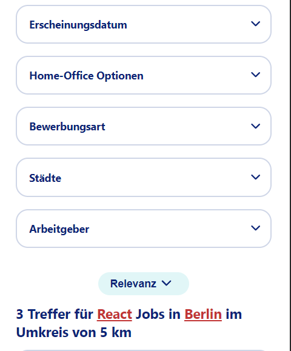

# StepStone Clone

## Overview

This project is a clone of the StepStone website, demonstrating proficiency in using TypeScript, Styled Components, React, Redux, and Semantic HTML. It serves as a showcase of web development skills and the ability to recreate a complex web application.

https://stepstoneclone.netlify.app/


## Technologies Used

- **React**: A JavaScript library for building user interfaces.
- **Redux**: A state management library for managing the application's state.
- **TypeScript**: A superset of JavaScript that adds static typing to the language.
- **Styled Components**: A library for styling React components using tagged template literals.
- **Semantic HTML**: Utilizing HTML5 to create a clear and meaningful structure for better accessibility and SEO.
- **Google Web Vitals**: 
   - Desktop (via Incognito Browser): Score of 96 (Performance), 94 (Accessibilty), 100 (Best Practices), 100 (SEO)
   - Mobile (via Incognito Browser): Score of 69 (Performance), 94 (Accessibilty), 100 (Best Practices), 100 (SEO)

## Features

- **Responsive Design**: The application is designed to be responsive, providing an optimal viewing experience across a wide range of devices.
  
- **State Management with Redux**: Utilizes Redux to manage the state of the application, providing a centralized and predictable state container.

- **Styled Components**: Styles are implemented using Styled Components, offering a modular and maintainable approach to styling.

- **TypeScript Integration**: The use of TypeScript adds static typing to the project, enhancing code quality and providing better development tooling support.

## Getting Started

1. **Clone the Repository**

   ```bash
   git clone https://github.com/MyNameIsCarsten/react-stepstone.git
   ```

2. **Install Dependencies**

   ```bash
   cd stepstone-clone
   npm install
   ```

3. **Run the Application**

   ```bash
   npm start
   ```

   The application will be accessible at `http://localhost:3000` in your web browser.

## Folder Structure

- **src/components**: Contains React components used to build the UI.
- **src/store**: Houses Redux-related files, such as actions, reducers, and the store configuration.
- **src/styles**: Holds global styles, themes, or any other styling-related files.
- **public**: Contains static assets and the HTML template.

## Images
### Starting Page

### Jobs Overview

### Jobs filtered and liked

### Mobile View




## Contributing

Feel free to contribute by opening issues or submitting pull requests. Follow the established coding style and structure.

## Acknowledgments

This project was created as a demonstration of skills and is not affiliated with or endorsed by StepStone. All trademarks are the property of their respective owners.